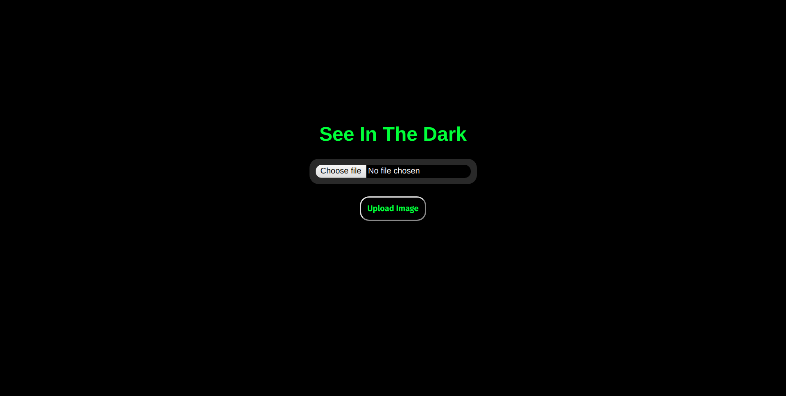
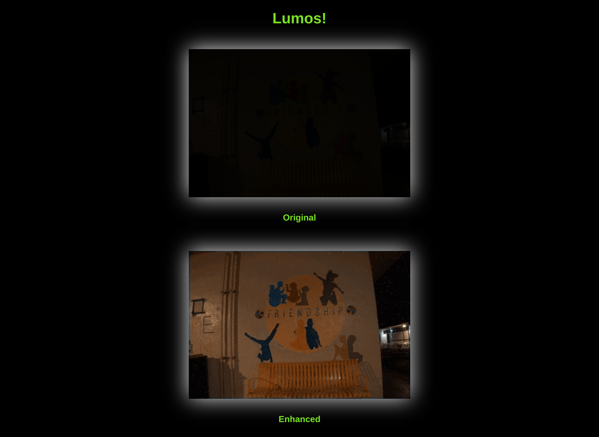

# See In The Dark
This project focuses on Low Light Photo Enhancement Using Simplified Fully Convolutional Neural Networks. This was attempted to produce a memory efficient model that can effectively run on edge devices and deliver an optimum level of image enhancement and noise reduction. 

## Table of contents
* [General Info](#general-info)
* [Packages Used](#packages-used)
* [Setup](#setup)
* [Usage](#usage)
* [Features](#features)
* [Screenshots](#screenshots)
* [References](#references)

## General Info
- This project is aimed at creating a solution to tackling the problem of Low Light Photography Using Simplified Fully Convolutional Neural Networks
- The Neural Network model architecture is written in PyTorch and the application is deployed using Flask
- The model was trained on the [Sony_gt Dataset](https://drive.google.com/drive/folders/1vlUte4X_qKUtm-D61eXuoJGSl2crsOCc?usp=sharing) which is a subset of the Sony dataset containing images of varying exposures
- This project was done as a part of The MLH Local Hack Day 2019

## Packages Used
- PyTorch
- Flask
- requests
- numpy

## Setup

### Requirements
- Python 3.3+

### Installation
- To install required packages:<br>
```bash
pip install -r requirements.txt
```

## Usage

### Linux
```bash
export FLASK_APP=app.py
flask run
```

### Windows
```bash
set FLASK_APP=app.py
flask run
```

## Screenshots

- Image Upload Page:


- Result Page:


## References
- <https://github.com/ninetf135246/pytorch-Learning-to-See-in-the-Dark>
- <https://github.com/cchen156/Learning-to-See-in-the-Dark>


